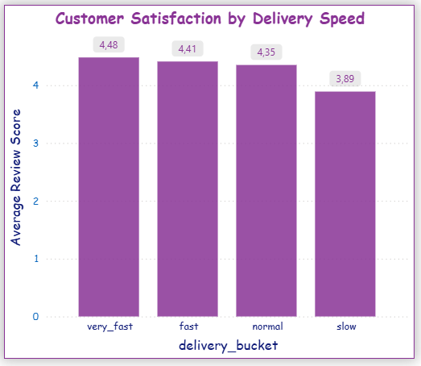
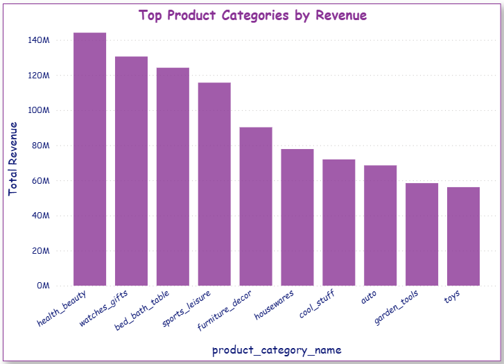

# Olist E-Ticaret Veri Analizi Projesi

Bu projede Olist e-ticaret veri seti kullanılarak SQL ve dbt ile veri modelleme ve analiz çalışmaları yapılmıştır. Amaç, iş tarafında kullanılabilecek anlamlı metrikler ve içgörüler elde etmektir.

## Kullanılan Araçlar

* BigQuery
* dbt
* Power BI

## Yapılan Çalışmalar

* Ham veriler staging katmanında düzenlendi
* Sipariş bazlı gelir hesaplandı
* Müşteri bazlı toplam harcama analiz edildi
* Ürün kategorilerine göre gelir dağılımı çıkarıldı
* Teslimat süresi ile müşteri memnuniyeti ilişkisi incelendi

## Öne Çıkan İçgörüler

* Teslimat süresi uzadıkça müşteri memnuniyetinin düştüğü görüldü
* Bazı ürün kategorilerinin toplam gelire katkısı diğerlerine göre daha yüksek

## Görselleştirme

Power BI ile aşağıdaki grafikler oluşturuldu:

* Delivery Speed vs Customer Satisfaction
* Top Product Categories by Revenue

## Not

Bu proje, veri analizi ve veri modelleme becerlerini geliştirmek amacıyla hazırlanmıştır.
# Olist E-Commerce Analytics Project

This project focuses on analyzing the Olist e-commerce dataset using SQL and dbt. The goal is to build meaningful metrics and generate insights that can support business decisions.

## Tools Used

* BigQuery
* dbt
* Power BI

## What Was Done

* Raw data was cleaned and organized in the staging layer
* Order-level revenue was calculated
* Customer-level total spending was analyzed
* Revenue distribution by product categories was explored
* The relationship between delivery time and customer satisfaction was analyzed

## Key Insights

* Customer satisfaction decreases as delivery time increases
* Some product categories contribute significantly more to total revenue

## Visualization

The following visuals were created in Power BI:

* Delivery Speed vs Customer Satisfaction
* Top Product Categories by Revenue

## Note

This project was completed to improve data analysis and data modeling skills.

## Görseller

### Teslimat Süresi vs Müşteri Memnuniyeti

### Kategori Bazlı Gelir

